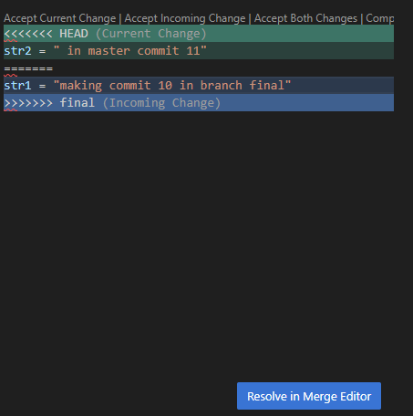

### Summary

# Git Notes

## Basic Commands
```bash
git init
git add filename
git commit -m "1 first commit"
git restore --staged filename   # revert staged file

Ignoring Files

Add unwanted files to .gitignore

git status won’t show them, only .gitignore itself appears as untracked

### Commits and logs
git log              # full log
git log --oneline    # short log (sha + msg)
git log --stat       # with file changes
git log -p           # show code changes
git show <sha>       # show particular commit
git diff
git log --oneline
git checkout <sha>


### Branching

git branch branch1        # create branch
git checkout branch1      # switch
git branch                # list branches (* = current)
git branch branch1 <sha>  # branch from commit


Branch & Merge Example

Master commits: 1 → 2 → 3 → 6 → 7

Branch1 commits: 1 → 2 → 3 → 4 → 5


git log --oneline --all --graph
* d250db1 (master) 7. commit
* 1b24304 6. commit
| * 3cd80fa (branch1) 5. commit
| * 04af00c 4. commit
|/  
* 38d2917 3. commit
* 3f51814 2. commit
* b8f8692 1. commit

git branch -d branch1      # safe delete
git branch -D branch1      # force delete


### Merging
git checkout master
git merge branch2

Fast-forward merges directly

If conflicts: fix in editor → git add → git commit

### Remote
git remote add origin https://github.com/Jay-hv7/git-notes.git
git push origin master


### Detailed Description

git init
git add filename
git commit -m "1 first commit"
<!-- make any other change to first.py -->
git add filename 
<!-- to revert back to a status before git add first.py, then -->
git restore --staged filename

<!-- Few files we don't want git to track and it should ignore, then add those file names to .gitignore

when you check git status, it will not show the files which are entered in .gitignore , only .gitignore file will be shown 
as untracked file which can be git add and commit -->

<!-- For each commit unique id is created by git called sha id -->
### git log
git log gives all the commits , latest commit of the respective branch is shown as HEAD->master (master is the branch)
commit ece6640cd5f983ed261a0c3a1de245176cb746ca (HEAD -> master)
Author: user <user@gmail.com>
Date:   Tue Oct 7 19:35:37 2025 +0530

    add .gitignore

commit 3f518144fdcb0c834903c632db9445848b81b328
Author: user <user@gmail.com>
Date:   Tue Oct 7 19:31:30 2025 +0530

    2 second commit

commit b8f869233fa54196ff3a67a1ab70446fd631f1ff
Author: user <user@gmail.com>
Date:   Tue Oct 7 19:25:30 2025 +0530

### git log --oneline : it gives sha id and commit messages
git log --oneline
ece6640 (HEAD -> master) add .gitignore
3f51814 2 second commit
b8f8692 1 first commit

### git log --stat : Along with git log it gives the changes done in each commit (insertion, deletion etc)

commit 3f518144fdcb0c834903c632db9445848b81b328
Author: user <user@gmail.com>
Date:   Tue Oct 7 19:31:30 2025 +0530

    2 second commit

 first.py | 3 ++-
 1 file changed, 2 insertions(+), 1 deletion(-)

 ### git log -p : code changes in the files(all) committed

 ### git show sha id : will show the changes of that particular commit

 PS C:\Jay_projects\ML-Ops\git-tutorials> git show 3f51814
commit 3f518144fdcb0c834903c632db9445848b81b328
Author: user <userhv7@gmail.com>
Date:   Tue Oct 7 19:31:30 2025 +0530

    2 second commit

diff --git a/first.py b/first.py
index 08e06c0..1fb2c51 100644
--- a/first.py
+++ b/first.py
@@ -1 +1,2 @@
-x = "welcome to MLOps project"
\ No newline at end of file
+x = "welcome to MLOps project"
+y = "welcome to git tutorials"

### git diff 

PS C:\Jay_projects\ML-Ops\git-tutorials> git diff
a/first.py - after commit, b/first.py before commit
diff --git a/first.py b/first.py 
index 1fb2c51..14d3497 100644
--- a/first.py
+++ b/first.py
@@ -1,2 +1,2 @@
 x = "welcome to MLOps project"
-y = "welcome to git tutorials"
\ No newline at end of file
+y = "welcome to git tutorials"

## git checkout shaid:
git log --oneline 
38d2917 (HEAD -> master) 3 third commit
ece6640 add .gitignore
3f51814 2 second commit
b8f8692 1 first commit

git checkout b8f8692   (all the files will roll back to where it was in the first commit (sha id of first commit is taken in this example))

### git branch branchname :  To crete branch
git branch branch1


### git checkout master : to switch to master branch
### git branch : To see all the branches * indicates current branch
 branch1
* master


## Branching and merging

- to go to any commit use git checkout shaid
- to go to any branch git checkout master (or branch name)
- to create any branch from a particular commit: git branch branchname shaid


1. Create a branch branch1 from master
git checkout master
git branch branch1
git branch --show-current (to see current branch)


2. switch to new branch created in step 1
git checkout branch1

3. create a new file and add that file and commit (commit 4 in the series)

4. add a line to the new file created and add that file and commit again (commit 5)

5. switch to master branch: git checkout master
- new file (branch1.py) will be deleted (not permanently)
6. make some changes to first.py , git add and git commit (commit 6)
7. again make some changes to first.py, git add, git commit (commit 6)
8. git log will show the commits done on master branch (commit 1,2,3,6,7)
9. git checkout branch1
10. git log --oneline : This will show the commit 1,2,3 4,5 (ie before switching to master from branch1 whatever commits are done in master and branch1)

Master : commit1 -> commit2 --> commit3-->commit6 -->commit7
branch1: commit1-->commit2-->commit3-->commit4--->commit5 (after commit3 we switched to branch1 and then make commit 4 and 5)

11. #### git log --oneline --all --graph
git log --oneline --all --graph
* d250db1 (master) 7. commit
* 1b24304 6. commit
| * 3cd80fa (HEAD -> branch1) 5 branch1 work done
| * 04af00c 4. branch1 file added
|/  
* 38d2917 3 third commit
* ece6640 add .gitignore
* 3f51814 2 second commit
* b8f8692 1 first commit

## to delete the branch : git branch -d branchname
git branch -d branch1
error: cannot delete branch branch1 used by worktree

### to delete a branch come to main branch ie master and then forcefully delete

- git branch -D branch1 ( forcefully deleting the branch from master, even if u r in master branch and use -d to delete a branch same error will come, so use -D )

###  Demo
- create new branch branch2 and switch to branch2
- make 2 commits 8 and 9
- git branch branch2
- git checkout branch2

now git log will show commit 1--2--3--6-7--8--9 (upto 7 it is master before switching to branch2, then commits happened in branch2 ie 8 and 9)


### Merging
git checkout master
git merge <branchname>

git checkout master

Switched to branch 'master'

git merge branch2

Updating d250db1..4e7750d
Fast-forward
 branch2.py | 2 ++
 1 file changed, 2 insertions(+)
 create mode 100644 branch2.py

 - - Now if we see git log:
 git log --oneline
4e7750d (HEAD -> master, branch2) 9. commit
1aae332 8. commit
d250db1 7. commit
1b24304 6. commit
38d2917 3 third commit
3f51814 2 second commit
b8f8692 1 first commit


### Advanced Merge
Now in master branch git log will give the following
commit1 -->2-->3-->6-->7-->8-->9

create a new branch final, make a commit 10 (edit file first.py which is present in master also)

switch back to master, make a commit 11 (edit file first.py)

Be in master , 
- git merge final:
Auto-merging first.py
CONFLICT (content): Merge conflict in first.py
Automatic merge failed; fix conflicts and then commit the result.

click on accept current change (whatever done in master)
click on incoming current change (whatever done in final)


### git remote

git remote add origin https://github.com/Jay-hv7/git-notes.git
be in the branch which need to be pushed to github
git push origin master


